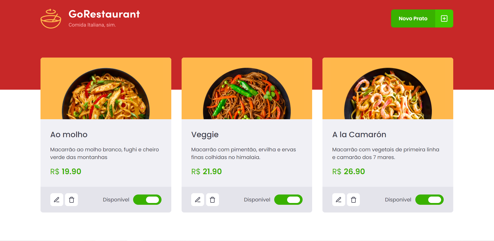

# Desafio Ignite Refatorando classes para Typescript 🚀

## Go Restaurant 🍕

## O que faz?
- Aplicação que lista pratos vindos de uma fake API feita com JSON Server
- Opção de cadastrar um novo prato na fake API 
- Opção de alterar alguma informação do prato na fake API 

## Cadastro de novos pratos

## Tecnologias utilizadas ⚙️
- React
- Typescript
- JSON server 
- Styled-components

## Habilidades desenvolvidas 👨‍💻
- Utilizar dados de uma fake API 
- Refatoração de código javascript para typescript
